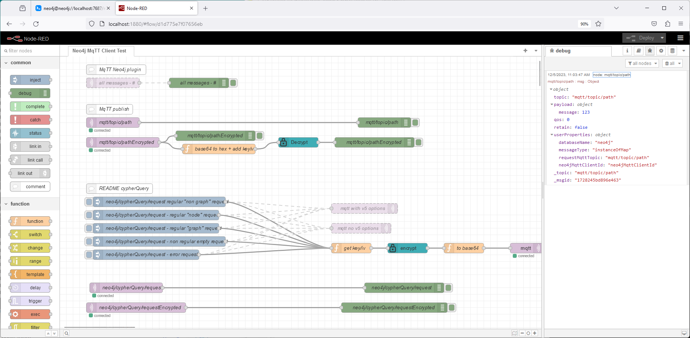

# Neo4j MQTT v5 Client
Neo4j branch: 5.x  
root: https://github.com/bzupan/neo4j-mqtt-client 

Introduction

The Neo4j MQTT v5 Client is a powerful bridge between Neo4j Graph Databases and the Internet of Things (IoT) ecosystem. This client facilitates seamless communication between a Neo4j database and IoT networks by enabling the database to process, stream, and execute Cypher queries based on incoming MQTT messages. By leveraging the MQTT version 5 protocol, this client empowers Neo4j databases to interact bidirectionally with IoT networks, allowing for real-time data processing, event streaming, and efficient execution of database operations.

With functionalities such as publishing MQTT messages from within the database, subscribing to and processing incoming messages, and managing connections to MQTT brokers, this client opens doors to a wide array of IoT-driven applications within the Neo4j environment. 

Through this seamless integration, users can harness the power of Neo4j's graph-based data structure to derive insights, perform complex data manipulations, and drive actions based on real-time IoT data, thereby bridging the gap between IoT ecosystems and graph databases.

Some of the possible applications:
- Neo4j database is listening to the IoT messages and runs Cypher queries upon received data,
- Neo4j database can stream database events via the IoT network,
- Neo4j database Cypher queries can be executed using IoT network,
- ...

Neo4j Graph Database MQTT v5 Client Functions and Procedures:
- Publishing MQTT Messages from Neo4j Graph Database
- Subscribing to and Processing MQTT Messages in the Neo4j Graph Database

## Notes
- Utilizes the [HiveMQ MQTT Client](https://www.hivemq.com/article/mqtt-client-library-enyclopedia-hivemq-mqtt-client/) for Java 
- Tested with [Eclipse Mosquitto 2.0.18](https://mosquitto.org/) MQTT Broker
- Tested with [Neo4j 5.13 Community Edition](https://neo4j.com/deployment-center/) Graph Database
- Based on excellent [neo4j-procedure-template](https://github.com/neo4j-examples/neo4j-procedure-template/)
- Requires [Neo4j 5 APOC](https://github.com/neo4j/apoc) plugin ([APOC 5.x](https://github.com/neo4j/apoc/releases) needs to be installed)
- [MQTT version 5](https://docs.oasis-open.org/mqtt/mqtt/v5.0/mqtt-v5.0.html) only 
- Currently only TCP transfer protocol implemented
- [Node RED test flows](test/node-red/node-red_neo4jMqttClientTests.json) are prepared for examples demonstrated in this README
- Versioning - first two version numbers match Neo4j and APOC release - you need to use the plugin version to match APOC and Neo4j version

## Setup
[Setup](./README_testSetup.md)

# Managing Neo4j MQTT Clients and Connections
Effectively managing Neo4j MQTT clients involves a series of steps, from registering the client within the Neo4j environment to establishing a stable connection with the MQTT broker. Once this connection is established, the Neo4j MQTT client is primed to interact seamlessly with the MQTT broker.

The initial step revolves around the registration of the Neo4j MQTT broker client within the Neo4j database. This process lays the groundwork for establishing a connection with the MQTT broker. Once registered, the client is ready to engage in bidirectional communication.

The Neo4j MQTT broker client provides three primary functions:
- connectBroker: Initiates the connection between the Neo4j database and the MQTT broker. This function sets the foundation for the exchange of MQTT messages.
- listBrokers: Offers a listing of the registered MQTT brokers within the Neo4j environment. This function enables easy access to broker information for management and monitoring purposes.
- disconnectBroker: Facilitates the termination of the connection between the Neo4j database and the MQTT broker. This function ensures the controlled disconnection of the client, maintaining system integrity.

Utilizing MQTT Messaging
Upon successful connection establishment, the Neo4j MQTT client gains the capability to interact with MQTT messages. These messages can be both published from the Neo4j database to the MQTT broker or subscribed to, allowing the database to receive and process incoming messages from the broker.

## Register Neo4j MQTT Client and Connect the MQTT Broker
Cypher query
```cypher
RETURN mqtt.connectBroker(
    'neo4jMqttClientId',          // Unique ID of the MQTT Client
    {
        serverHost:'localhost',   // MQTT Broker IP Address
        serverPort:1883           // MQTT Broker Port
    }
)
```

## List Neo4j MQTT Clients/Connections and Show Details
Cypher query
```cypher
RETURN mqtt.listBrokers()
```

## Disconnect MQTT Broker and Unregister Neo4j MQTT Client
Cypher query
```cypher
RETURN mqtt.disconnectBroker(
  'neo4jMqttClientId'           // Neo4j MQTT Client ID to Disconnect
)
```
# Generate AES-CBC Encryption Key (key) and Initialization Vector (IV)
The Neo4j MQTT broker client offers support for AES-CBC payload encryption, ensuring secure data transmission. To enable this encryption, AES-CBC key and initialization vector (IV) in base64 encoded format are required.

The utility function, generateAesCbcKeyIv, has been designed specifically for this purpose. Upon invocation, this function generates the necessary AES-CBC key and IV, ensuring secure symmetric encryption. Please see examples of decrypting and encrypting MQTT payloads using provided keys.

Cypher query
```cypher
RETURN mqtt.generateAesCbcKeyIv()
```
Sample Response
```json
{
  "ivBase64": "7CCPV/M/BQMsM2c1zWvpsKFEA+dAeqMIFeWSs1Sfkjw=",
  "keyHex": "7bf17ec2679f36c1e40b385791a35bc2de323a3ff14b7af763a585e47bb97128",
  "keyText": "{�~�g�6��\u000b8W��[��2:?�Kz�c���{�q(",
  "ivText": "� �W�?\u0005\u0003,3g5�k鰡D\u0003�@z�\u0015咳T��<",
  "keyBase64": "e/F+wmefNsHkCzhXkaNbwt4yOj/xS3r3Y6WF5Hu5cSg=",
  "ivHex": "ec208f57f33f05032c336735cd6be9b0a14403e7407aa30815e592b3549f923c"
}
```
# Publishing MQTT Messages with the Neo4j MQTT Client
The Neo4j MQTT client offers specialized Cypher functions and procedures tailored for publishing MQTT v5 messages seamlessly. These functions and procedures are designed to facilitate the efficient transmission of data from the Neo4j database to MQTT v5 networks.

- publishMessage Function  
The publishMessage function serves as a versatile tool for publishing Neo4j objects, such as maps, nodes, and relations, as MQTT messages. Notably, when provided with a list, this function dynamically sends MQTT messages for each element within the list. This functionality ensures a flexible and scalable approach to message transmission. Explore the provided examples to grasp the diverse applications and adaptability of this function.

- publishGraph Procedure 
The publishGraph procedure operates by executing Cypher queries within the Neo4j environment and subsequently publishing the resulting Neo4j graph as an MQTT message. This procedure efficiently exports the Neo4j graph data to a JSON-based nodes and relationships object, which is then transmitted over MQTT. Refer to the examples provided to gain insights into executing queries and publishing Neo4j graphs effectively.

## Neo4j publishMessage Function
#### Following Cypher query will publish simple MQTT message.
Cypher query
```cypher
// --- publish simple map object "{message:123}" to "mqtt/topic/path" topic using  'neo4jMqttClientId' Neo4j MQTT Client 
RETURN mqtt.publishMessage(
    'neo4jMqttClientId',        // Neo4j MQTT Client ID
    'mqtt/topic/path',          // topic to publish to
    {message:123}               // payload
)
```
Response to Cypher query
```json
{
  "topic": "mqtt/topic/path",
  "message": {
    "message": 123
  },
  "status": "OK",
  "neo4jMqttClientId": "neo4jMqttClientId",
  "statusMessage": "MQTT Publish OK"
}
```
Received MQTT Message on 'mqtt/topic/path' 
```json
{
  "topic": "mqtt/topic/path",
  "payload": {
    "message": 123
  },
  "qos": 0,
  "retain": false,
  "userProperties": {
    "databaseName": "neo4j",
    "messageType": "instanceOfMap",
    "requestMqttTopic": "mqtt/topic/path",
    "neo4jMqttClientId": "neo4jMqttClientId"
  }
}

```


  

#### Following Cypher query will publish MQTT message adding responseTopic and correlationData options to the MQTT v5 message.  
Cypher query
```cypher
// --- Publish MQTT Message with MQTT v5 options "responseTopic" and "correlationData"
RETURN mqtt.publishMessage(
    'neo4jMqttClientId', 
    'mqtt/topic/path', 
    {message:123}, 
    {                                              // MQTT v5 options map
        responseTopic:"mqtt/topic/path/response",  
        correlationData:"messageId-123" 
    }
)
```
Received MQTT Message on 'mqtt/topic/path' 
```json
{
  "topic": "mqtt/topic/path",
  "payload": {
    "message": 123
  },
  "qos": 0,
  "retain": false,
  "responseTopic": "mqtt/topic/path/response",
  "correlationData": [
    109,
    101,
    115,
    115,
    97,
    103,
    101,
    73,
    100,
    45,
    49,
    50,
    51
  ],
  "userProperties": {
    "databaseName": "neo4j",
    "messageType": "instanceOfMap",
    "requestMqttTopic": "mqtt/topic/path",
    "neo4jMqttClientId": "neo4jMqttClientId"
  }
}
```

#### AES-CBC payload encryption is enabled if additional parameters are provided in the options map.        
Message will be published as base6 encoded string - all userProperties will be removed from the message!

Cypher query
```cypher
// --- AES-CBC encrypt MQTT payload and publish message to the mqtt/topic/pathEncrypted topic
RETURN mqtt.publishMessage(
    'neo4jMqttClientId', 
    'mqtt/topic/pathEncrypted', 
    {message:123}, 
    {
        encryption: "aes-cbc",                    // currently only aes-cbc is supported
        ivBase64: "FnAxDoCHpgHkrZr3jRGmbA==",     // Base64 encoded IV  
        keyBase64: "2ggLKL4wxTwmZQ8kPMCT8A=="     // Base64 encoded AES-CBC key
    }  
)
```
Received MQTT Message on 'mqtt/topic/pathEncrypted' 
```json
{
  "topic": "mqtt/topic/pathEncrypted",
  "payload": "+CYr1PLLU9PtBMNRTFqDDg==",
  "qos": 0,
  "retain": false
}
```


  

#### We can pass node or relation to the message - node / relation will be published as JSON object - see examples.    
Cypher query with node as payload
```cypher
// --- publish single node as JSON document to 'mqtt/topic/path'
MERGE (s:MqttTestNode {someProp:"startNode"})-[l:MQTT_TEST {someProp:"linkProp"}]->(e:MqttTestNode {someProp:"endNode"})
RETURN mqtt.publishMessage(
  'neo4jMqttClientId', 
  'mqtt/topic/path', 
  s
)
```
Received MQTT Message on 'mqtt/topic/path' 
```json
{
  "topic": "mqtt/topic/path",
  "payload": {
    "elementId": "4:6fd8bab9-128b-4f8a-adc3-6ea50ea8e2d0:29",
    "database": "neo4j",
    "identity": 29,
    "properties": {
      "someProp": "startNode"
    },
    "labels": [
      "MqttTestNode"
    ]
  },
  "qos": 0,
  "retain": false,
  "userProperties": {
    "databaseName": "neo4j",
    "messageType": "instanceOfNode",
    "requestMqttTopic": "mqtt/topic/path",
    "neo4jMqttClientId": "neo4jMqttClientId"
  }
}
```
#### Cypher query with relation as payload
```cypher
// --- publish single node as JSON document to 'mqtt/topic/path'
MERGE (s:MqttTestNode {someProp:"startNode"}) -[l:MQTT_TEST {someProp:"linkProp"}]->(e:MqttTestNode {someProp:"endNode"})
RETURN mqtt.publishMessage(
  'neo4jMqttClientId', 
  'mqtt/topic/path', 
  l
)
```
Received MQTT Message on 'mqtt/topic/path' 
```json
{
  "topic": "mqtt/topic/path",
  "payload": {
    "elementId": "5:6fd8bab9-128b-4f8a-adc3-6ea50ea8e2d0:1",
    "database": "neo4j",
    "start": 29,
    "identity": 1,
    "endElementId": "4:6fd8bab9-128b-4f8a-adc3-6ea50ea8e2d0:30",
    "end": 30,
    "startElementId": "4:6fd8bab9-128b-4f8a-adc3-6ea50ea8e2d0:29",
    "type": "MQTT_TEST",
    "properties": {
      "someProp": "linkProp"
    }
  },
  "qos": 0,
  "retain": false,
  "userProperties": {
    "databaseName": "neo4j",
    "messageType": "instanceOfRelationship",
    "requestMqttTopic": "mqtt/topic/path",
    "neo4jMqttClientId": "neo4jMqttClientId"
  }
}
```

#### If list is provided - for every object MQTT messages will be send!
```cypher
// --- publish list of nodes JSON document to 'mqtt/topic/path' - please note for every node in the list MQTT message will be send
MATCH (n:MqttTestNode)  
RETURN mqtt.publishMessage(
  'neo4jMqttClientId', 
  'mqtt/topic/path', 
  n
)
```
#### Cypher query with APOC export
We can export graph data as JSON using APOC export json query - please note JSON export format from the APOC export json query differs from our node-relation JSON format. Refer to the examples provided to understand these differences and effectively manage the exported data.
```cypher
// --- publish graph using APOC JSON export 
CALL apoc.export.json.query(
    'MATCH (s:MqttTestNode)-[l:MQTT_TEST]->(e:MqttTestNode) RETURN *',
    null,
    {stream: true}
)
YIELD  data AS apocJsonGraph
RETURN mqtt.publishMessage(
    'neo4jMqttClientId', 
    'mqtt/topic/path', 
    apocJsonGraph
)
```
Received MQTT Message on 'mqtt/topic/path' 
```json
{
  "topic": "mqtt/topic/path",
  "payload": {
    "s": {
      "type": "node",
      "id": "4",
      "labels": [
        "MqttTestNode"
      ],
      "properties": {
        "someProp": "startNode"
      }
    },
    "e": {
      "type": "node",
      "id": "5",
      "labels": [
        "MqttTestNode"
      ],
      "properties": {
        "someProp": "endNode"
      }
    },
    "l": {
      "type": "relationship",
      "id": "2",
      "label": "MQTT_TEST",
      "properties": {
        "someProp": "linkProp"
      },
      "start": {
        "id": "4",
        "labels": [
          "MqttTestNode"
        ],
        "properties": {
          "someProp": "startNode"
        }
      },
      "end": {
        "id": "5",
        "labels": [
          "MqttTestNode"
        ],
        "properties": {
          "someProp": "endNode"
        }
      }
    }
  },
  "qos": 0,
  "retain": false,
  "userProperties": {
    "databaseName": "neo4j",
    "messageType": "instanceOfJson",
    "requestMqttTopic": "mqtt/topic/path",
    "neo4jMqttClientId": "neo4jMqttClientId"
  }
}
```

#### We can setup APOC trigger which will send MQTT messages upon database transactions - please see example
* to setup trigger see: https://neo4j.com/docs/apoc/current/background-operations/triggers/#_list_of_triggers
```
# setup apoc.conf with 
apoc.trigger.enabled=true
apoc.trigger.refresh=600

# setup neo4j.conf
dbms.security.procedures.unrestricted=apoc.*

# restart Neo4j
```
Cypher query to register trigger which will send MQTT message on node creation
```cypher
:use system
CALL apoc.trigger.install(
    'neo4j',
    'send-mqtt-message-when-new-node',
    'UNWIND $createdNodes AS n WITH n RETURN mqtt.publishMessage("neo4jMqttClientId", "mqtt/topic/path", n)',
    {phase: 'afterAsync'}    
);
:use neo4j
```

Cypher which will create new node and trigger MQTT message ...
```cypher
// --- test
CREATE (n:MqttTestTrigger)
RETURN n
```

... MQTT message received when new node is created.
```json
{
  "topic": "mqtt/topic/path",
  "payload": {
    "elementId": "4:6fd8bab9-128b-4f8a-adc3-6ea50ea8e2d0:31",
    "database": "neo4j",
    "identity": 31,
    "properties": {},
    "labels": [
      "MqttTestTrigger"
    ]
  },
  "qos": 0,
  "retain": false,
  "userProperties": {
    "databaseName": "neo4j",
    "messageType": "instanceOfNode",
    "requestMqttTopic": "mqtt/topic/path",
    "neo4jMqttClientId": "neo4jMqttClientId"
  }
}
```

## Neo4j publishGraph Procedure
Cypher query which will "publish" graph as single MQTT message - see example for request and message send (graph is exported as JSON nodes and relationships arrays). 
```cypher
// --- publish Neo4j graph using Cypher query with params + MQTT v5 "goodies"
CALL mqtt.publishGraph(
  'neo4jMqttClientId', 
  'mqtt/topic/path',
  'MERGE (s:MqttTestNode {someProp:"startNode"}) -[l:MQTT_TEST {someProp:"linkProp"}]->(e:MqttTestNode {someProp:"endNode"}) RETURN *',    // Cypher query
  {message:123},      // Cypher query params
  {
    responseTopic:"mqtt/topic/path/response"
  }
)
```
MQTT message received
```json
{
  "topic": "mqtt/topic/path",
  "payload": {
    "relationships": [
      {
        "elementId": "5:6fd8bab9-128b-4f8a-adc3-6ea50ea8e2d0:1",
        "database": "neo4j",
        "start": 29,
        "identity": 1,
        "endElementId": "4:6fd8bab9-128b-4f8a-adc3-6ea50ea8e2d0:30",
        "end": 30,
        "startElementId": "4:6fd8bab9-128b-4f8a-adc3-6ea50ea8e2d0:29",
        "type": "MQTT_TEST",
        "properties": {
          "someProp": "linkProp"
        }
      }
    ],
    "nodes": [
      {
        "elementId": "4:6fd8bab9-128b-4f8a-adc3-6ea50ea8e2d0:30",
        "database": "neo4j",
        "identity": 30,
        "properties": {
          "someProp": "endNode"
        },
        "labels": [
          "MqttTestNode"
        ]
      },
      {
        "elementId": "4:6fd8bab9-128b-4f8a-adc3-6ea50ea8e2d0:29",
        "database": "neo4j",
        "identity": 29,
        "properties": {
          "someProp": "startNode"
        },
        "labels": [
          "MqttTestNode"
        ]
      }
    ]
  },
  "qos": 0,
  "retain": false,
  "responseTopic": "mqtt/topic/path/response",
  "userProperties": {
    "cypherQuery": "MERGE (s:MqttTestNode {someProp:\"startNode\"}) -[l:MQTT_TEST {someProp:\"linkProp\"}]->(e:MqttTestNode {someProp:\"endNode\"}) RETURN *",
    "relationships": "1",
    "nodes": "2",
    "databaseName": "neo4j",
    "cypherParams": "{message=123}",
    "neo4jMqttClientId": "neo4jMqttClientId",
    "publishTopic": "mqtt/topic/path",
    "cypherQueryStatus": "OK"
  }
}
```

# Subscribing to MQTT Messages with Neo4j
The Neo4j MQTT client offers two distinct subscription procedures, each tailored to different use cases, allowing seamless integration of MQTT messages into the Neo4j database ecosystem.

subscribeCypherQuery Procedure
The subscribeCypherQuery procedure functions akin to the MQTT "BOLT" protocol, enabling the execution of database queries upon receiving MQTT messages. This subscription method facilitates direct interaction with the Neo4j database through Cypher queries triggered by incoming MQTT messages. Explore the examples provided to comprehend the intricacies and applications of this query-based subscription procedure.

subscribeCypherRun Procedure
Contrasting the previous method, the subscribeCypherRun procedure automates the execution of predefined Cypher queries upon the reception of MQTT messages. These predefined queries are executed with the MQTT message content populated as query parameters, enhancing the flexibility and adaptability of message-based interactions within the Neo4j environment. Review the examples to understand the implementation and advantages of this subscription approach.

## Neo4j subscribeCypherQuery Procedure
By executing the following Cypher Query, the Neo4j MQTT Client will subscribe to the designated topic and handle incoming messages as Cypher query requests. 
Request should be in format query, param, options - see example.
```cypher
// --- listen on 'neo4j/cypherQuery/request' with an default response topic passed as "responseTopic"
CALL mqtt.subscribeCypherQuery(
  'neo4jMqttClientId',               // Neo4j MQTT Client ID
  'neo4j/cypherQuery/request',       // topic to listen for Cypher query requests in format {query: ""Cypher Query", params: {} }
  {                                  // options map with default response topic where query results will be published if no MQTT "responseTopic" is present in the request message
      responseTopic:'neo4j/cypherQuery/resultsDefault'
  }
) 
```

Graph MQTT Cypher Query Request message send on "neo4j/cypherQuery/request" topic will trigger ...
```json
{
  "topic": "neo4j/cypherQuery/request",
  "payload": {
    "query": "MERGE (n:MqttTestNode) ON CREATE SET n.count=1, n.message=$message ON MATCH SET n.count = n.count +1, n.message=$message WITH n MERGE (n)-[l:MQTT_TEST]->(m:MqttTestNode) RETURN *",
    "params": {
      "message": "setup message"
    }
  },
  "qos": 0,
  "retain": false,
  "responseTopic": "neo4j/cypherQuery/results"
}
```

... MQTT message received on "neo4j/cypherQuery/results" topic. Please note @graph JSON object with nodes and relations arrays is added to the Cypher query keys! Please note the query metadate send as an MQTT v5 userProperties object.
```json

{
  "topic": "neo4j/cypherQuery/results",
  "payload": {
    "@graph": {
      "relationships": [
        {
          "elementId": "5:6fd8bab9-128b-4f8a-adc3-6ea50ea8e2d0:1",
          "database": "neo4j",
          "start": 1,
          "identity": 1,
          "endElementId": "4:6fd8bab9-128b-4f8a-adc3-6ea50ea8e2d0:3",
          "end": 3,
          "startElementId": "4:6fd8bab9-128b-4f8a-adc3-6ea50ea8e2d0:1",
          "type": "MQTT_TEST",
          "properties": {}
        }
      ],
      "nodes": [
        {
          "elementId": "4:6fd8bab9-128b-4f8a-adc3-6ea50ea8e2d0:3",
          "database": "neo4j",
          "identity": 3,
          "properties": {},
          "labels": [
            "MqttTest"
          ]
        },
        {
          "elementId": "4:6fd8bab9-128b-4f8a-adc3-6ea50ea8e2d0:1",
          "database": "neo4j",
          "identity": 1,
          "properties": {
            "count": 1,
            "message": "setup message"
          },
          "labels": [
            "MqttTest"
          ]
        }
      ]
    },
    "l": [
      {
        "elementId": "5:6fd8bab9-128b-4f8a-adc3-6ea50ea8e2d0:1",
        "database": "neo4j",
        "start": 1,
        "identity": 1,
        "endElementId": "4:6fd8bab9-128b-4f8a-adc3-6ea50ea8e2d0:3",
        "end": 3,
        "startElementId": "4:6fd8bab9-128b-4f8a-adc3-6ea50ea8e2d0:1",
        "type": "MQTT_TEST",
        "properties": {}
      }
    ],
    "m": [
      {
        "elementId": "4:6fd8bab9-128b-4f8a-adc3-6ea50ea8e2d0:3",
        "database": "neo4j",
        "identity": 3,
        "properties": {},
        "labels": [
          "MqttTestNode"
        ]
      }
    ],
    "n": [
      {
        "elementId": "4:6fd8bab9-128b-4f8a-adc3-6ea50ea8e2d0:1",
        "database": "neo4j",
        "identity": 1,
        "properties": {
          "count": 1,
          "message": "setup message"
        },
        "labels": [
          "MqttTestNode"
        ]
      }
    ]
  },
  "qos": 0,
  "retain": false,
  "userProperties": {
    "correlationData": "correlationId-test01",
    "cypherQuery": "MERGE (n:MqttTestNode) ON CREATE SET n.count=1, n.message=$message ON MATCH SET n.count = n.count +1, n.message=$message WITH n MERGE (n)-[l:MQTT_TEST]->(m:MqttTestNode) RETURN *",
    "relationships": "1",
    "subscriptionType": "subscribeCypherQuery",
    "nodes": "2",
    "databaseName": "neo4j",
    "cypherParams": "{message=setup message}",
    "responseTopic": "neo4j/cypherQuery/results",
    "requestTopic": "neo4j/cypherQuery/request",
    "neo4jMqttClientId": "neo4jMqttClientId",
    "cypherQueryStatus": "OK"
  }
}
```


Following Cypher Query will subscribe Neo4j Client to the provided topic and process encrypted messages as query requests.
```cypher
// --- listen on 'neo4j/cypherQuery/requestEncrypted' with an default response topic passed as "responseTopic"
CALL mqtt.subscribeCypherQuery(
  'neo4jMqttClientId',               // Neo4j MqTT Client ID
  'neo4j/cypherQuery/requestEncrypted',       // topic to listen for Cypher query requests in format {query: "Cypher Query", params: {} }
  {                                  // options map with default response topic where query results will be published
      responseTopic:'neo4j/cypherQuery/resultsDefault',  // default response topic
      encryption: "aes-cbc",                    // currently only aes-cbc is supported
      ivBase64: "FnAxDoCHpgHkrZr3jRGmbA==",     // Base64 encoded iv 
      keyBase64: "2ggLKL4wxTwmZQ8kPMCT8A=="     // Base64 encoded key
  }
) 
```
Graph MQTT Cypher Query Request message send on "neo4j/cypherQuery/requestEncrypted" topic will trigger ...
```json
{
  "topic": "neo4j/cypherQuery/requestEncrypted",
  "payload": "fx3FGoWEiZvkaTs09bhR0BaFOY7WJF3V1mQLaD+9LEf11utoIL0rgmIYLRhhrvfJ5nikR2+5BeC87EInl2l5vUrxvWNkBMIgMVGKaEIJgTl4UOUPsIQ+DkyCuyZWtSr9+forB0xL2it6SU+ATkbn7gp0QhkHrYwhj8iXsOGkfLurvQgQJgZ+tpJi+wbMOseaw3mkuZWjH+2aqNNvnU7+YpoR4lBv0+nXDYiYzT+YAxw=",
  "qos": 0,
  "retain": false,
  "responseTopic": "neo4j/cypherQuery/resultsEncrypted",
}
```
... MQTT message received on "neo4j/cypherQuery/resultsEncrypted" topic. Please note that Cypher query metadata is removed - no "userProperties" in the MqTT message!
```json
{
  "topic": "neo4j/cypherQuery/resultsEncrypted",
  "payload": "AiB5GVZ2EKjj9aYHsDJcfjKWjJA8DbkO6JsX6wQ4M/jlkMy6faZvgvPmbFhwTCG6U0kWgAkrf93ztHgcY12iH9Ll1piAN4yJJPDTsAcWtxAW4xXvtuu0a9sy2B/LX+gk0IO4xfXinPpN540c/UpPmbWimKYzbZBi/sxRt76TmEeuYlhUP0T1gI6kj7uVngkGSZyykVn+rvFc1xqLIUDDQOO94WhmOsSWpWVC59/7g0z/z7bdc3DIWHYsIvAyYd1oRj/UMe3bpRRiQ4aSzX1DoJseGvBl4Npj1vE13o2GHSIyIeiBNeGRnG0aQnsw/DW1vUK1sAwB1iSfnfZnEU7FE13p5+4UViCJ+WantMfz+7bPfpp0/9orLhJunJhM+8t75td+TYXJ7/K1nszocHv4wPH4l/PUnlHa5xAzZbHkEd77XmcxqpNvnzNL9zaxHp+YKsfbI1etXwu8M87iyy//EmxQHo2dd7zTYm4IupUTn6Gd+Y680PsvIxFKqTqNx3HjFYmZq3DzvLP9bpURmiZsioz+kYWO65lg+zp3qB+zJDIPnQXUu1GqDt0jaYez1Zv3V+otQ7UyM2PIvE/6/HQbeWHPDgbzNsyWb9jHuOiX3yHabViu38rWdeSr7zLluY8jDH6ZxRz8/gGqZN53XF2nLDasSxiKJjf8hYBm+JDMywbo17URplLcQpH5u4ASwH8Y7C7uRev3XWnj5XxdUKjU4kTciT39UROBgt1jdqh10+Km12+oNz5JKxy9bbS2PIqOKDlRrS8RsFt54rQHSKOC6SNfzsSUSEUq9PIP5pHwyxhS+AGTEzwN/DVIkfJZSo6DVtHG39iWFIy53jYBcD3UCy3uBi7OrReZ+NWAZeb5Y2L8n8IIJO1vlTi88sE/2/VzncciGd6Gs4T5XgoyQvAsqj2cz74LaFJc2fwzIOFdy5c=",
  "qos": 0,
  "retain": false
}
```


## Neo4j subscribeCypherRun Procedure 
Upon receiving MQTT messages, predefined Cypher queries stored within the subscription will automatically execute. The content of the received message will populate the query parameters, allowing seamless execution of the stored query associated with the subscription.
```cypher
// --- listen on 'neo4j/cypherQuery/request' with an default response topic passed as option "responseTopic"
CALL mqtt.subscribeCypherRun(
  'neo4jMqttClientId',                // Neo4j MqTT Client ID
  'neo4j/cypherRun/request',          // topic to listen for MQTT messages / query params
  'MERGE (n:MqttTestSubscribe) ON CREATE SET n.count=1, n.message=$message ON MATCH SET n.count = n.count +1, n.message=$message RETURN n', // Cypher query - query params will be received by the message
  {                                   // options map with default response topic where query results will be published
    responseTopic:'neo4j/cypherRun/resultsDefault'
  } 
)
```

Following MQTT message send to "neo4j/cypherRun/request" will trigger ...
```json

{
  "topic": "neo4j/cypherRun/request",
  "payload": {
    "message": "response goes to provided topic"
  },
  "qos": 0,
  "retain": false,
  "responseTopic": "neo4j/cypherRun/results"
}
```
... MQTT message receive on "neo4j/cypherRun/results"
```json
{
  "topic": "neo4j/cypherRun/results",
  "payload": {
    "@graph": {
      "relationships": [],
      "nodes": [
        {
          "elementId": "4:6fd8bab9-128b-4f8a-adc3-6ea50ea8e2d0:32",
          "database": "neo4j",
          "identity": 32,
          "properties": {
            "count": 8,
            "message": "response goes to provided topic"
          },
          "labels": [
            "MqttTestSubscribe"
          ]
        }
      ]
    },
    "n": [
      {
        "elementId": "4:6fd8bab9-128b-4f8a-adc3-6ea50ea8e2d0:32",
        "database": "neo4j",
        "identity": 32,
        "properties": {
          "count": 8,
          "message": "response goes to provided topic"
        },
        "labels": [
          "MqttTestSubscribe"
        ]
      }
    ]
  },
  "qos": 0,
  "retain": false,
  "userProperties": {
    "correlationData": "id123",
    "cypherQuery": "MERGE (n:MqttTestSubscribe) ON CREATE SET n.count=1, n.message=$message ON MATCH SET n.count = n.count +1, n.message=$message RETURN n",
    "relationships": "0",
    "subscriptionType": "subscribeCypherRun",
    "nodes": "1",
    "databaseName": "neo4j",
    "cypherParams": "{message=response goes to provided topic}",
    "responseTopic": "neo4j/cypherRun/results",
    "requestTopic": "neo4j/cypherRun/request",
    "neo4jMqttClientId": "neo4jMqttClientId",
    "cypherQueryStatus": "OK"
  }
}
```

... or sample error MQTT message receive on "neo4j/cypherRun/results"
```json
{
  "topic": "neo4j/cypherRun/results",
  "payload": {
    "@graph": {
      "relationships": [],
      "nodes": []
    },
    "error": "org.neo4j.graphdb.QueryExecutionException: Expected parameter(s): message"
  },
  "qos": 0,
  "retain": false,
  "userProperties": {
    "correlationData": "id123",
    "cypherQuery": "MERGE (n:MqttTestSubscribe) ON CREATE SET n.count=1, n.message=$message ON MATCH SET n.count = n.count +1, n.message=$message RETURN n",
    "relationships": "0",
    "subscriptionType": "subscribeCypherRun",
    "nodes": "0",
    "databaseName": "neo4j",
    "cypherParams": "{noMessage=123.0}",
    "responseTopic": "neo4j/cypherRun/results",
    "requestTopic": "neo4j/cypherRun/request",
    "neo4jMqttClientId": "neo4jMqttClientId",
    "cypherQueryStatus": "ERROR"
  }
}
```


Following Cypher Query will subscribe Neo4j Client to the provided topic and process encrypted messages as query requests.
```cypher
// --- listen on 'neo4j/cypherRun/requestEncrypted' with an default response topic passed as "responseTopic" and AES-CBC properties
CALL mqtt.subscribeCypherRun(
  'neo4jMqttClientId',                          // Neo4j MqTT Client ID
  'neo4j/cypherRun/requestEncrypted',           // topic to listen for MQTT messages / query params
  'MERGE (n:MqttTestSubscribe) ON CREATE SET n.count=1, n.message=$message ON MATCH SET n.count = n.count +1, n.message=$message RETURN n', // Cypher query - query params will be received by the message
   {                                            // options map with default response topic where query results will be published
      responseTopic:'neo4j/cypherQuery/resultsDefault',  // default response topic
      encryption: "aes-cbc",                    // currently only aes-cbc is supported
      ivBase64: "FnAxDoCHpgHkrZr3jRGmbA==",     // Base64 encoded iv 
      keyBase64: "2ggLKL4wxTwmZQ8kPMCT8A=="     // Base64 encoded key
  }
)
```
Following AES-CBC encrypted MQTT message send to "neo4j/cypherRun/requestEncrypted" will trigger ...
```
{
  "topic": "neo4j/cypherRun/requestEncrypted",
  "payload": "UggTX2UioU86GZ1IXNMUObl2hbbRfpCXZgL3H/yh8CHlcFwhPqCqLQzkL8IyOEGx",
  "qos": 0,
  "retain": false,
  "responseTopic": "neo4j/cypherRun/resultsEncrypted",
  "correlationData": [
    99,
    111,
    114,
    114,
    101,
    108,
    97,
    116,
    105,
    111,
    110
  ]
}
```
... encrypted MQTT message received on "neo4j/cypherRun/resultsEncrypted"
```
{
  "topic": "neo4j/cypherRun/resultsEncrypted",
  "payload": "AiB5GVZ2EKjj9aYHsDJcfjKWjJA8DbkO6JsX6wQ4M/jlkMy6faZvgvPmbFhwTCG6U0kWgAkrf93ztHgcY12iH9Ll1piAN4yJJPDTsAcWtxA2orD9YBSe6lAQiQDMzzxRLzFUaXunHACGEBUv42fy9ofc0OCh9x1wye7jQznCsUVn1Ha/sjiuyKG0yd95g3irM9WOGS4CiFPIBk1LB/Qvnf3ZAiodKAFHUSYgVVtXNzJFXEwNbh8ZjbEYoZOqcB4ZQYVgjH7Sr/4cAnb8rNxMCFEqr9L5A/bMDj87NhD56VedLa3aUSCEZFPjegAVv/sxSIY0vrU5GRDwK8S/eRnbguVBd1V+3zo/55ducnRAJi3TEc474kG/Gbo7eqGmg7vr6H0NTx6vr701z4IS7cjOdbuzBTx8GB4SZBf3CkmIxa+BsQuCXvstMlIuWdk9v58CtqvbX/3RbGYIwp/Owm08buchMpyS/HBExb9SpjU1WYcqRcYff3msEfAyfKFII2QGZMhc8C1KiqGA4r4Gp5L/K4sjIYrPmxMEHSu7yUO9PXfnfe9h0a+PVbQuiC1S9AuG",
  "qos": 0,
  "retain": false,
  "correlationData": [
    99,
    111,
    114,
    114,
    101,
    108,
    97,
    116,
    105,
    111,
    110
  ]
}
```

